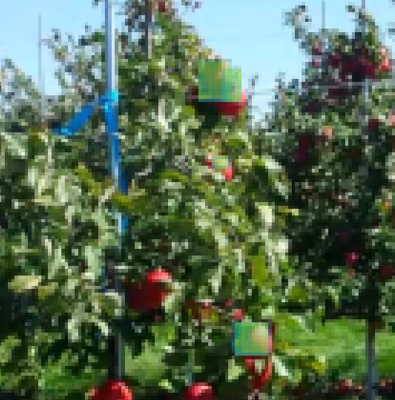
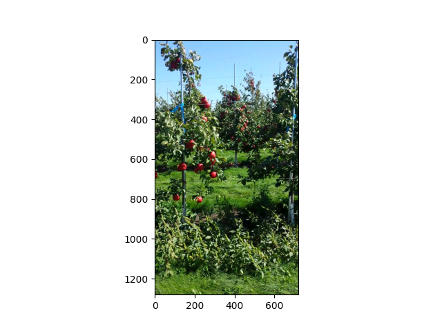
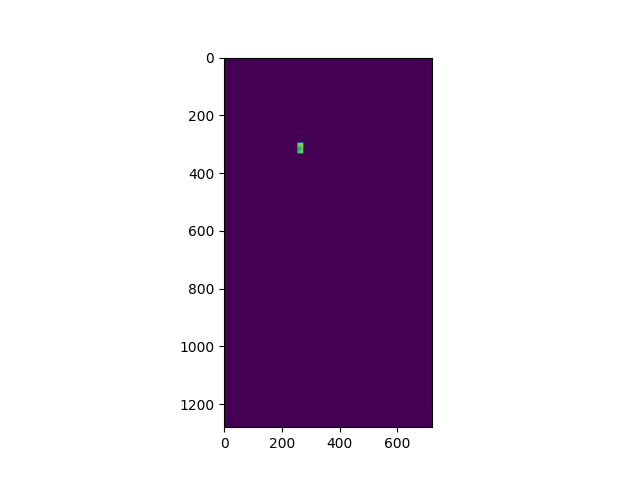
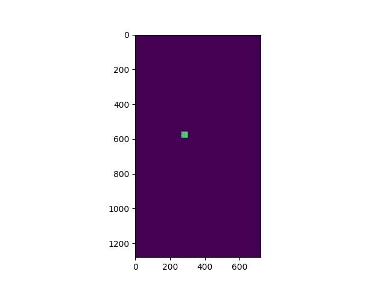
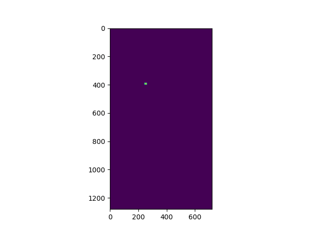
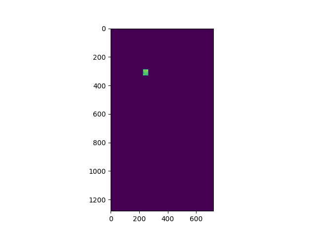

# 2023 Digital AgAthon Labor Challenge Project

Based off of the PyTorch Torchvision object detection finetuning tutorial. Uses a pre-trained Mask R-CNN model that is finetuned to detect apples in orchards. The dataset used for traning "MinneApple: A Benchmark Dataset for Apple Detection and Segmentation"
- Torchvision Object Detection Finetuning Tutorial - https://pytorch.org/tutorials/intermediate/torchvision_tutorial.html#torchvision-object-detection-finetuning-tutorial
- MinneApple: A Benchmark Dataset for Apple Detection and Segmentation - https://conservancy.umn.edu/handle/11299/206575

# Example

<p align="left">
    </a>
    </a>
    </a>
    </a>
    </a>
    </a>
</p>

    

# Guide

First, clone this repository, 
 - Install PyTorch and required dependencies, can be found in the torchvision object detection tutorial. Torchvision utilities are included in this repository.
 - To test if your gpu is conneted
```
python gpu.py
```
- To train the model on your the appletrain dataset
```
python training.py
```
- To demo and test the model on an image from the dataset
```
python test.py
```
- load.py contains the model and dataset information.


# To do
 
 The detection isn't the most accurate as we were only given 48 hours to complete the project and train it. Due to hardware constraints we weren't able to train extensively.
 
 - fix the output to draw masks over the images
 - fix the number of masks outputted in demo
